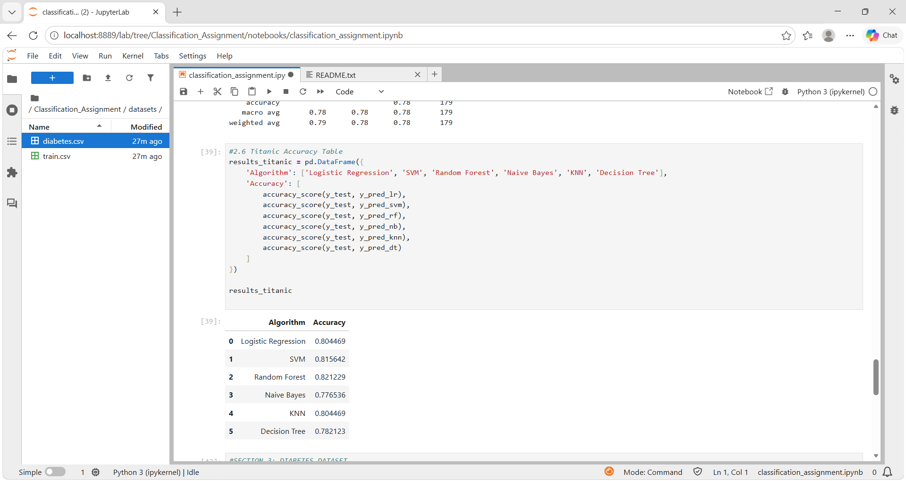
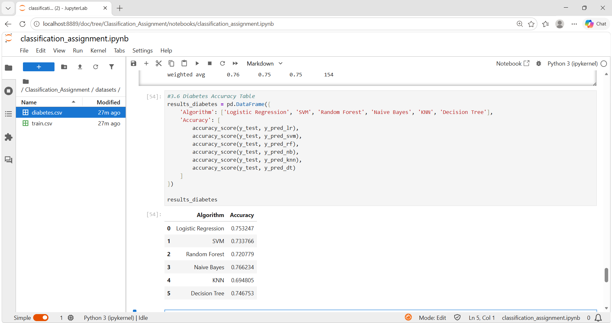

<div align="center">

# 🤖 Classification Model Benchmarking

### Comparing 6 supervised ML classifiers on Titanic & Diabetes datasets — from raw data to evaluated results.

[](https://python.org)
[](https://scikit-learn.org)
[](https://jupyter.org)
[](#-algorithms-benchmarked)
[](#-datasets)
[](LICENSE)

</div>

---

## 📌 Project Overview

This project implements and compares **6 supervised machine learning classification algorithms** on two real-world Kaggle datasets — **Titanic** (survival prediction) and **Diabetes** (diagnosis prediction).

It covers the full ML pipeline: data loading, preprocessing, feature scaling, model training, and performance evaluation using standard classification metrics.

| Detail | Value |
|---|---|
| Datasets | Titanic · Diabetes |
| Algorithms compared | 6 classifiers |
| Evaluation metrics | Accuracy, Confusion Matrix, F1-Score |
| Train / Test split | 80% / 20% |
| Best accuracy (Titanic) | **82.12% — Random Forest** |
| Best accuracy (Diabetes) | **76.62% — Naive Bayes** |

---

## 🎯 Objectives

- Apply multiple classification algorithms on real-world datasets
- Preprocess and prepare raw data for model training
- Compare model performance using standard evaluation metrics
- Identify the best-performing model for each dataset

---

## 📂 Datasets

### 🚢 Titanic Dataset
Binary classification: *did the passenger survive?*

**Features used:** `Pclass` · `Sex` · `Age` · `SibSp` · `Parch` · `Fare` · `Embarked`

**Preprocessing:**
- Filled missing values — `Age` (median), `Fare` (median), `Embarked` (mode)
- Dropped irrelevant columns: `PassengerId`, `Name`, `Ticket`, `Cabin`
- Label-encoded: `Sex`, `Embarked`

---

### 💉 Diabetes Dataset
Binary classification: *does the patient have diabetes?*

**Features used:** `Pregnancies` · `Glucose` · `BloodPressure` · `SkinThickness` · `Insulin` · `BMI` · `DiabetesPedigreeFunction` · `Age`

**Preprocessing:** Dataset was clean — no missing values. Features and target (`Outcome`) extracted directly.

---

## 🛠️ Algorithms Benchmarked

| # | Algorithm | Feature Scaling | Notes |
|---|---|---|---|
| 1 | Logistic Regression | ✅ StandardScaler | |
| 2 | Support Vector Machine | ✅ StandardScaler | Default RBF kernel |
| 3 | Random Forest | ❌ Not required | 100 estimators, `random_state=42` |
| 4 | Naive Bayes | ✅ StandardScaler | GaussianNB |
| 5 | K-Nearest Neighbors | ✅ StandardScaler | `k=5` |
| 6 | Decision Tree | ❌ Not required | `random_state=42` |

---

## 📊 Benchmark Results

### 🚢 Titanic — Accuracy Comparison

| Algorithm | Accuracy | Bar |
|---|---|---|
| Logistic Regression | 80.45% | `████████████████████░░░░` |
| SVM | 81.56% | `████████████████████░░░░` |
| **Random Forest** | **82.12% 🏆** | `█████████████████████░░░` |
| Naive Bayes | 77.65% | `███████████████████░░░░░` |
| KNN | 80.45% | `████████████████████░░░░` |
| Decision Tree | 78.21% | `███████████████████░░░░░` |

> ✅ **Winner: Random Forest** with **82.12%** accuracy on Titanic

---

### 💉 Diabetes — Accuracy Comparison

| Algorithm | Accuracy | Bar |
|---|---|---|
| Logistic Regression | 75.32% | `███████████████████░░░░░` |
| SVM | 73.38% | `██████████████████░░░░░░` |
| Random Forest | 72.08% | `██████████████████░░░░░░` |
| **Naive Bayes** | **76.62% 🏆** | `███████████████████░░░░░` |
| KNN | 69.48% | `█████████████████░░░░░░░` |
| Decision Tree | 74.68% | `██████████████████░░░░░░` |

> ✅ **Winner: Naive Bayes** with **76.62%** accuracy on Diabetes

---

## 📸 Screenshots

| Titanic Results | Diabetes Results |
|---|---|
|  |  |

---

## 📁 Project Structure

```bash
classification-model-benchmarking/
│
├── datasets/
│   ├── diabetes.csv              # Pima Indians Diabetes dataset
│   └── train.csv                 # Titanic training dataset
│
├── notebooks/
│   └── classification_assignment.ipynb   # Full notebook with outputs
│
├── python_files/
│   └── python_files.py           # Standalone Python script
│
├── screenshots/
│   ├── Diabetes_Accuracy_Table.png
│   └── Titanic_Accuracy_Table.png
│
├── requirements.txt
├── README.md
└── .gitignore
```

---

## ⚙️ Workflow

```
1. Data Loading        →  Load CSVs using Pandas
2. Preprocessing       →  Impute missing values, drop irrelevant cols, encode categoricals
3. Feature Scaling     →  StandardScaler for Logistic Regression, SVM, Naive Bayes, KNN
4. Train/Test Split    →  80% train / 20% test | random_state=42
5. Model Training      →  Train all 6 classifiers on both datasets
6. Evaluation          →  Accuracy score + Confusion matrix + Classification report
```

---

## 📊 Evaluation Metrics

| Metric | Description |
|---|---|
| **Accuracy Score** | Percentage of correctly classified samples |
| **Confusion Matrix** | TP, TN, FP, FN breakdown for each class |
| **Classification Report** | Per-class Precision, Recall, and F1-Score |

---

## ▶️ Getting Started

### Step 1 — Clone the repository
```bash
git clone https://github.com/Keertiraj2004/classification-model-benchmarking.git
cd classification-model-benchmarking
```

### Step 2 — Install dependencies
```bash
pip install -r requirements.txt
```

### Step 3 — Run the Jupyter Notebook
```bash
jupyter notebook notebooks/classification_assignment.ipynb
```

Or run directly as a Python script:
```bash
python python_files/python_files.py
```

---

## 📦 Requirements

```
pandas
numpy
scikit-learn
jupyterlab
notebook
```

---

## 💡 Key Learnings

- How different classification algorithms work under the hood
- Why feature scaling matters for distance- and probability-based models
- How model performance varies across datasets with different characteristics
- How to evaluate classifiers beyond just accuracy (F1, Precision, Recall)
- How to structure a machine learning project for reproducibility

---

## 🚀 Planned Improvements

- [ ] Data visualization using Matplotlib and Seaborn
- [ ] Hyperparameter tuning with GridSearchCV
- [ ] K-fold cross-validation for more reliable estimates
- [ ] Feature importance analysis (SHAP / permutation importance)
- [ ] Model deployment using Streamlit or Flask
- [ ] Expand to additional Kaggle datasets

---

## 👨‍💻 Author

**Keertiraj Kamble**  
Engineering Student · Aspiring Data Scientist · ML Enthusiast

[](https://github.com/Keertiraj2004)
[](https://www.linkedin.com/in/keertiraj-kamble)

---

<div align="center">
  <sub>Developed as part of a Machine Learning Classification Assignment · MIT License</sub>
</div>
